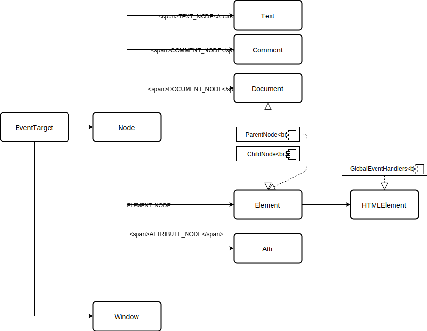

# Javascript

## 简介

JavaScript是一个[函数先行](https://developer.mozilla.org/en-US/docs/Glossary/First-class_Function)的多范式语言，本文不是讲解JS的文档，仅对JS与其他常见语言的异同作比较

我们常说的JavaScript实际上是JavaScript本身和浏览器提供的DOM API共同组成

下面我们分别说明这两部分


纸上得来终觉浅，随时打开浏览器的控制台或使用nodejs去尝试，还可以在[codepen](https://codepen.io/pen)网站在线编辑


## JavaScript的特殊点

JavaScript本身是一个很简单且不那么严谨的语言（动态且弱类型）


从MDN可以查阅JS内置的[标准库和方法](https://developer.mozilla.org/zh-CN/docs/Web/JavaScript/Reference/Global_Objects)，需要注意的是，不同浏览器对内置标准库的实现程度不太一致，可以通过MDN文档中的兼容性列表部分查看每个方法的兼容性。


### JS是动态弱类型语言

JS的动态体现在，JS的变量在声明时不需要指定类型。解释器会在赋值时在内部记录变量的类型，并在运行到该行时，动态检查变量的类型。

```javascript
var a = 1;
a.getTime() // 只有运行时才会出错
```

同时，JS中的函数，也是动态声明的（注意JS中的变量提升）

```javascript
function foo() {
    var a = 1;
    // 在执行foo函数时，bar函数才被声明
    function bar() {
        console.log(a);
    }
}

foo();
```


看起来像Java的推断类型？他与推断类型最大的区别在于，Java会在编译时检查类型错误。


弱类型体现在，JS会隐式的转换一些原本无法操作的数据类型

```javascript
var a = 1;
var b = '2';
console.log(a / b); // 输出number类型的0.5
console.log(a + b); // 输入string类型的'11'
```

因此写JS的时候要额外注意，避免因类型不同导致的错误

### JS的事件循环机制

与Java的传统线程模式不同的是，JS采用了事件循环机制，首先介绍几个概念

* 事件队列，是一个包含所有要处理事件的队列，队列中的每个事件都对应着一个处理函数
* 调用栈，和所有常见语言一致，执行函数时会向调用栈中压入一个栈帧

JS引擎会不断得从事件队列中获取事件，并调用事件的处理函数，JS引擎采用**单线程**处理事件，在栈清空之前不会获取后面的消息。因此，事件是**依次**被处理的，不存在并发导致的临界资源。但是这就意味着，如果某一个事件处理函数执行时间过长，可能会使后面的事件不能及时被处理，导致页面卡顿。

JS中的异步操作实际上是异步函数立即完成，后续等异步操作完成时，再向事件队列插入一个事件


虽然JS引擎是单线程的，但是并不意味着包含着JS引擎的浏览器，NodeJS等执行环境也使用一个线程，

以NodeJS为例，NodeJS由V8引擎和libuv库组成，JS中的异步操作会交给libuv处理，libuv完成后会在JS的事件队列中添加一个事件


```javascript
function foo() {
    setTimeout(() => {
        console.log('timeout1')
    }, 0);
    // 使用for循环模拟耗时操作
    const limit = Math.pow(2, 32);
    for (let i = 0; i < limit; i += 1) {
    }
    console.log('finish');
}

foo();
```

`setTimeout`函数在0毫秒后会在事件处理函数上添加一个事件。但是在foo函数执行完毕之前，调用栈不会清空，`setTimeout`函数的回调函数也不会被调用

### `var`、`let`、`const`

在JS中，var、let、const都是声明变量的关键字，他们的区别如下

在Java等大多数语言中变量的都是块级作用域（在Java中是由`{}`包括的部分）

但是`var`声明的变量其作用域是执行上下文（可以简单的理解成函数体，即每个函数执行的时候都会创建一个上下文），当创建上下文时，解释器会首先做创建的准备工作（这就是JS中函数提升、变量提升的原因）

```javascript
function foo() {
    // 执行foo函数创建了一个上下文，创建时会声明变量a，变量a在整个上下文中都有效
    console.log(a); // 输出undefined，变量提升，a已经声明但未初始化
    for(var a = 0;a < 3; a+=1){ // 为a赋值的语句
        // ...
    }
    console.log(a); // 输出3，a的作用域是当前执行上下文
}
foo();
```

`const`、`let`的作用域都是块级，且不存在变量提升，区别在于`const`用于声明常量，`let`用于声明变量

```javascript
function foo() {
    // 取消下一句的注释会抛出异常，const和let声明的变量不存在变量提升
    // console.log(a); 
    const a = 'a';
    for(let a = 0;a < 3;a += 1){ // 这里声明了块级变量a, 在下面的块中无法访问外部的a变量
        console.log(a) // 会分别输出1, 2, 3
    }
    // 取消下面的注释会抛出异常，const声明的是常量，不允许重新赋值
    // a = 'b';
    console.log(a); // 输出'a'
}
foo();
```

### `==` 和`===`比较运算符

在JS中存在两种比较运算符`==`和`===`


建议永远都**不使用**`==`比较运算符，使用`==`可能会产生难以发现的BUG


他们的区别是`===`是严格的比较运算符，只有当比较的两个对象类型相同且值相等时返回的结果才是true

`==`会先进行隐式转换，将一些本来不可以比较的类型变得可以比较

```javascript
1 == '1' // true
1 === '1' // false
1 == true // true
1 === true // false
undefined == null // true
undefined === null // false
NaN == NaN // false
NaN === NaN // false
```


NaN（Not a Number）与任何对象比较都`false`，对NaN的比较要使用Number.isNaN方法

需要注意的是JS中存在一个全局的isNaN方法（对，这就是JS中的糟粕），这个方法比较的结果并不可靠，永远都不要使用这个方法比较NaN。

对于不支持Math.isNaN方法的浏览器，可以使用[polyfill](https://developer.mozilla.org/zh-CN/docs/Web/JavaScript/Reference/Global_Objects/Number/isNaN#Polyfill)（为旧浏览器提供它不支持的新功能的代码称为polyfill）解决


### JS中的类型与字面值

JS中有六种基本类型（es6新增了Symbol类型），除了基本类型以外的类型都是对象（包括Function，Array等）

基本类型如下

* Boolean
* null
* undefined
* String
* Number
* Symbol

需要注意的是以下几点

#### 字面值与包装类型

对于基本类型，使用字面值声明的是值类型，使用`new`关键字声明的是包装原始类型的引用类型，为了避免错误，**请只使用字面值声明基本类型**。同时，由于JS引擎做了特殊处理，基本类型依然可以调用包装类型的方法。


使用[console](https://developer.mozilla.org/zh-CN/docs/Web/API/Console)相关的API输出非基本类型时会导致被输出的对象无法被[GC](https://zh.wikipedia.org/wiki/%E5%9E%83%E5%9C%BE%E5%9B%9E%E6%94%B6_%28%E8%A8%88%E7%AE%97%E6%A9%9F%E7%A7%91%E5%AD%B8%29)，因此，在生产代码中，必须要删除用于调试的console语句（可以使用eslint等语法检查工具协助检查）


```javascript
1 === new Number(1) // false
1 == new Number(1) // true,这里是因为js自动转换了类型
new Number(1) === new Number(1) // false
'a' === new String('a') // false 
typeof 'a' // string
typeof new String('a') // object
```

### JS中的this指向问题

JS中也存在this关键字，但是与Java中永远指向当前对象不同的是，JS中this的指向不是那么的直观。

首先，方法在JS中是[第一类对象](https://zh.wikipedia.org/wiki/%E7%AC%AC%E4%B8%80%E9%A1%9E%E7%89%A9%E4%BB%B6)，因此函数可以作为参数传递，可以赋值给变量、也可以作为函数的返回值。

其次，JS中，由`function`关键字声明的函数，在执行时会创建一个属于自己的上下文，上下文中包含当前作用域、this等信息，`this`的指向也是在此时确定。

在此基础上，`this`的指向，实际上是在函数调用时才决定的。

```javascript
function Bar() {
    this.a = 1;
}

Bar.prototype.foo = function () {
    console.log(this.a);
}


const foo = bar.foo;
foo()                    // 输出undefined
```


在[严格模式](https://developer.mozilla.org/zh-CN/docs/Web/JavaScript/Reference/Strict_mode)中上面的代码会抛出异常


绝大多数情况下，JS中的`this`指向执行函数时所处的对象，参考下面的代码

```javascript
const obj = {
    a: 1,
    b: {
        bar: function(callback) {
            callback() // this在这里确定，执行callback时没有指向任何对象，非严格模式下指向window
        }
    },
    foo: function() {
        // this不在这里确定
        console.log(this.a)
    }
}

obj.foo() // this在此确定，指向obj
obj.b.bar(obj.foo) // 对于obj.foo来说this在真正执行时确定，也就是第5行
const foo = obj.foo;
foo() // foo没有指向任何对象，非严格模式下，this指向window

```


从JS的规范上解释的话，上面的说法是不严谨的，下面的代码中`(false || obj.foo)`返回obj.foo，但是代码执行的结果与上面却不一样。有兴趣的可以参考[从ECMAScript规范解读this](https://github.com/mqyqingfeng/Blog/issues/7)


```javascript
const obj = {
    a: 1,
     foo: function() {
        // this不在这里确定
        console.log(this.a)
    }
}
obj.foo()             // this指向obj
(false || obj.foo)() // 非严格模式下，this指向window
```

当`this`没有指向预期的对象时，可以使用下面几种方法解决

### 解决this指向的问题

这三个方法存在于`Function`的原型链上，可以实现调用方法时指定`this`对象

#### 使用[bind](https://developer.mozilla.org/zh-CN/docs/Web/JavaScript/Reference/Global_Objects/Function/bind)绑定

bind包装原来的方法，返回一个绑定方法，调用绑定方法时执行包装函数，通过给bind方法传参，可以指定包装函数的this对象，还可以为包装函数传递参数。


```javascript
function.bind(thisArg[, arg1[, arg2[, ...]]])
```

`thisArg`指定包装函数的`this`对象，arg1，arg2等不定参数会按顺序传递给包装函数


```javascript
function add(a, b) {
    return a + b;
}
const addOne = add.bind(null, 1); // 指定执行add函数时，this对象为null，第一个参数a为1;
addOne(2); // 3

const obj = {
    a: 1,
    increment: function(value) {
        this.a += value;
    },
};
const increment = obj.increment.bind(obj); // 在执行increment方法时，将this指向obj对象
setTimeout(function() {
    increment(10); 
}, 1000)
```

#### 使用[call](https://developer.mozilla.org/zh-CN/docs/Web/JavaScript/Reference/Global_Objects/Function/call)、[apply](https://developer.mozilla.org/zh-CN/docs/Web/JavaScript/Reference/Global_Objects/Function/apply)

与bind函数不同的是，`call`、`apply`不再返回一个包装函数，而是直接执行当前函数，这两个函数同样可以指定this对象和为函数传参

他们两个的区别是

* `call`使用不定参数为函数传参
* `apply`使用数组\(也可以为类数组的对象）为函数传参 

```javascript
const obj = {
    a: 1,
    increment(...values) {
        for(let i = 0;i < values.length;i += 1) {
            this.a += values[i];
        }
    },
}

const increment = obj.increment;

increment.call(obj, 2, 3, 4); // 执行increment方法时this指定为obj对象
increment.apply(obj, [2, 3, 4]);

const array1 = [1, 2, 3];
const array2 = ['a', 'b', 'c'];

Array.prototype.push.apply(array1, array2); // 将数组array2的元素添加到数组array1中
```

#### 使用箭头函数

es6中新增加了箭头函数，与`function`关键字声明的函数不同，箭头函数不在执行时确定`this`的指向，相反，箭头函数的`this`在声明时确认，并且在执行时不再改变（bind、apply、call也无法改变）。


记住JS的动态性，只有在外层函数执行时，箭头函数才会声明


```javascript
function Foo() {
    this.a = 1;
    // 此函数当成构造函数使用时, this指向构造函数的新对象
    // 箭头函数在下面声明
    // 因此箭头函数执行时，this对象永远指向这个新对象
    setTimeout(() => {
        console.log(this.a);
    }, 1000);
}
// 下面的函数永远不会按照预期执行
// 箭头函数声明时，this指向window（严格模式下为undefined）
Foo.prototype.bar = () => {
    console.log(this.a);
}
```

### JS中的原型链和继承

JS采用了一种叫[原型链](https://developer.mozilla.org/zh-CN/docs/Web/JavaScript/Inheritance_and_the_prototype_chain)的方式实现对象的继承，这与Java中经典的继承模式有很大的区别，最开始使用时可能感觉这里很难理解

下面简单解释一下原型链和原型链相关的一些概念，一次接触如此多的概念可能会让人迷惑，建议先通篇阅读一遍，当遇到问题时，再结合实际情况阅读此章节。

* 每个对象有一个`__proto__`属性指向该对象的原型对象
* 在访问对象的属性时，会先依次搜索自身和原型对象中的属性，直到`__proto__`指向`null`


\`\`[`__proto__`](https://developer.mozilla.org/zh-CN/docs/Web/JavaScript/Reference/Global_Objects/Object/proto)属性初期来自与浏览器的非标准实现，只有到es6时代，才将这个约定俗称的属性制定为标准，因此建议使用[Object.getPrototypeOf](https://developer.mozilla.org/zh-CN/docs/Web/JavaScript/Reference/Global_Objects/Object/getPrototypeOf)方法代替`__proto__`


#### 构造函数

构造函数的声明与普通函数没有什么区别（箭头函数不能当做构造函数），当一个普通函数使用`new`关键字调用时便称为构造函数。

构造函数有以下特点

* 每个构造函数都有一个`prototype`属性指向一个原型对象
* 上面的`prototype`对象又有一个`constructor`属性指向构造函数本身
* 使用`new`运算符操作构造函数默认返回一个新对象，这个对象的`__proto__`指向构造函数的`prototype`，在构造函数中返回一个对象的话，可以覆盖这个新对象。

```javascript
function Foo() {
    this.a = 1;
}
console.log(Foo.prototype) // 指向Foo的原型对象
console.log(Foo.prototype.constructor === Foo) // true

const foo = new Foo(); // new Foo()返回一个对象，构造函数中的this便是这个对象

var obj = {}
function Bar() { return obj; }

new Bar() === obj; // true
```

`new`关键字执行了以下操作

1. 新建了一个对象，并将这个对象的`__proto__`指向`constructor`的`prototype`
2. 调用构造函数，并将`this`指定成上一步中的新对象（箭头函数无法改变`this`，因此无法成为构造函数）
3. `new`操作符的返回便是，调用构造函数的结果

```javascript
function Foo() {
    this.a = 1;
}

const proto = {
    b: 'b',
    bar: function() {
        this.b = '2'
    },
}

Foo.prototype = proto; // 指定Foo的prototype

const foo = new Foo();

// foo继承自proto
// 因此形成了foo --> proto --> Object的继承关系
foo.__proto__ === proto; // true
Foo.prototype === proto; // true
proto.__proto__ === Object.prototype; // true


```

#### 对象继承

实际工作中，出于性能和内存占用的考虑，会使用如下方式进行继承



```javascript
function Animal(type) {
    this.type = type;
}

Animal.prototype.eat = function() {
    console.log('eat');
}

function Dog(name) {
    Animal.call(this, 'Dog'); // 3
    this.name = name;
}

const A = Object.create(Animal.prototype); // 仅做演示，实际中可以与下一句合二为一
Dog.prototype = Object.create(Animal.prototype); // 1
Dog.prototype.constructor = Dog; // 2

Dog.prototype.bark = function() {
    console.log(`${this.name} is barking`);
}

const dog = new Dog('Rocco');

// 下面展示原型链
dog.hasOwnProperty('name') // true
dog.hasOwnProperty('type') // 4，true
dog.__proto__ === A; // true
A.hasOwnProperty('bark') // true
A.__proto__ === Animal.prototype // true
Animal.prototype.hasOwnProperty('eat'); // true

dog instanceof Dog // true
dog instanceof Animal // true
```




上面使用了[Object.create](https://developer.mozilla.org/zh-CN/docs/Web/JavaScript/Reference/Global_Objects/Object/create)创建新的原型对象，在其他文档里可能介绍了使用空对象的方法创造原型对象


简单解释一下上面的代码

1. `Object.create`会创造一个新的对象，并将这个对象的`__proto__`设置为参数对象（可以理解为`new`操作符的第1步），我们假设这个对象为A
2. 默认情况下`Dog.prototype.constructor === Dog`（查看构造函数的特点），但是目前Dog.prototype指向A对象，而A对象的`constructor`属性目前不指向Dog，因此我们需要修复他们之间的关系。
3. 调用父类的构造函数，起到初始化父类实例变量的作用
4. 由于使用call函数指定了this，因此，这些实例变量实际属于Dog类的实例


## ES6

目前我们称之为JavaScript的语言实际上是由ECMA组织标准化的[ECMAScript](https://zh.wikipedia.org/wiki/ECMAScript)

es6实际上是该组织制定的ECMAScript的第6版，由于是在2015年发布，因此有些地方也叫它ES2015

从es5开始，JS变得越来越严谨，前端的开发也随之走上了工程化、模块化的道路

[ECMAScript 6 入门](https://es6.ruanyifeng.com/)这篇文档是学习es6最好的文档之一

## DOM API

[DOM](https://developer.mozilla.org/zh-CN/docs/Web/API/Document_Object_Model/Introduction)是对HTML等结构化文档操作的接口，[MDN](https://developer.mozilla.org/zh-CN/docs/Web/API/Document_Object_Model)中大量DOM的文档和相关知识，下面列出的所有接口也都可以在MDN查阅到



### [EventTarget接口](https://developer.mozilla.org/zh-CN/docs/Web/API/EventTarget)

EventTarget可以为不同的事件，添加和删除[事件侦听器（`EventListener`\)](https://developer.mozilla.org/zh-CN/docs/Web/API/EventListener)，也可以直接派发一个事件，DOM中的window、HTMLElement，XMLHttpRequest、WebSocket等都实现了该接口

EventTarget只有下面三个方法

* addEventListener
* removeEventListener
* dispatchEvent

### [Window对象](https://developer.mozilla.org/zh-CN/docs/Web/API/Window)

### Node接口

DOM是树形文档，Node是其中树的节点，`Document`、`Element`、`Attr`、`Text`等都继承了该接口，Node接口主要提供在树形结构中维护和查找其他节点的能力

下面是Node接口重要的属性和方法

#### 属性

* `childNodes`、`firstChild`、`lastChild`、`previousSibling`、`nextSibling`、`parentElement`、`parentNode`，这些属性提供了访问父节点、兄弟节点和子节点的能力
* nodeType、nodeName，表明当前节点的类型和类型名，具体含义可以查看[MDN](https://developer.mozilla.org/zh-CN/docs/Web/API/Node/nodeType)

#### 方法

* `appendChild`、`insertBefore`、`removeChild`、`replaceChild`，提供了添加、删除、替换子节点的能力
* `contains`，判断节点是否为当前节点的后代节点

### ParentNode和ChildNode接口

这两个接口在Node接口的基础上，额外增加了一些便利方法

#### ParentNode

* `querySelector`、`querySelectorAll`，提供使用CSS选择器查找后代元素的方法，querySelector返回第一个选中的元素，querySelectorAll返回一个静态的[NodeList](https://developer.mozilla.org/zh-CN/docs/Web/API/NodeList)
* `append`、`prepend`，提供更便捷的添加子元素的功能
* `firstElementChild`、`lastElementChild`、`children`，访问Element类型子节点的能力


